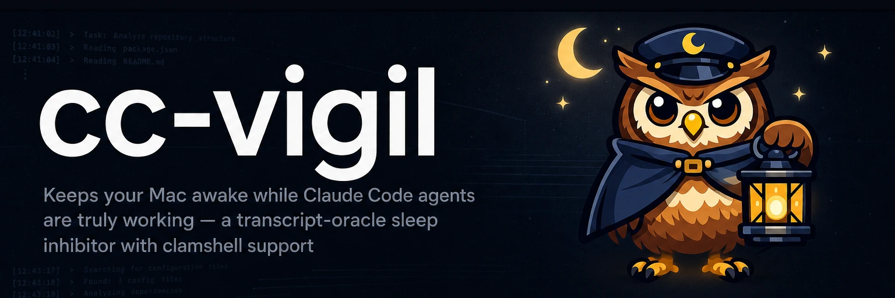

# 

**Awake while agents work. Asleep the moment they stop.** cc-vigil keeps your Mac awake while Claude Code agents are truly working — a transcript-oracle sleep inhibitor with clamshell support.

[](https://github.com/yasyf/cc-vigil/actions/workflows/ci.yml)
[](https://github.com/yasyf/cc-vigil/blob/main/LICENSE)

---

## Use cases

### Walk away from an overnight agent run

A long Claude Code run dies the moment macOS decides you're idle — you come back to a sleeping Mac and a half-finished task. cc-vigil watches the session transcripts and holds a sleep assertion for exactly as long as an agent is doing real work.

### Stop babysitting `caffeinate`

A blanket `caffeinate` outlives the work it was started for; forget it once and the fans run all night. cc-vigil's oracle reads the transcripts themselves, so the assertion drops the moment the last agent goes idle — no timers to guess, nothing to remember to kill.

### Close the lid and keep working

Clamshell sleep ignores ordinary idle assertions — shutting a MacBook normally ends the run no matter what. cc-vigil's clamshell support keeps agents working with the lid closed, and releases the machine to sleep as soon as they finish.

## Get started

### Homebrew

```sh
brew install yasyf/tap/cc-vigil
```

Apple Silicon, macOS 14 or newer. Launch cc-vigil once afterward to run first-run setup.

### Build from source

You need an Apple Silicon Mac (the bundled cc-transcript parser ships arm64-only for now), Xcode 26, and [XcodeGen](https://github.com/yonaskolb/XcodeGen) (`brew install xcodegen`).

```sh
git clone https://github.com/yasyf/cc-vigil.git
cd cc-vigil
xcodegen generate
xcodebuild -project CCVigil.xcodeproj -scheme CCVigil \
  -configuration Release -derivedDataPath build ONLY_ACTIVE_ARCH=YES build
cp -R build/Build/Products/Release/CCVigil.app /Applications/
open /Applications/CCVigil.app
```

The first run walks you through everything macOS requires:

1. **Background services** — CCVigil registers a per-user agent (the transcript oracle) and a root helper (the only process that touches power management). Approve both under System Settings → General → Login Items & Extensions when prompted.
2. **Claude Code hooks** — the installer adds tagged `cc-vigil nudge` hooks to `~/.claude/settings.json`. Your existing hooks are preserved untouched, and `cc-vigil uninstall-hooks` removes only the tagged entries.
3. **CLI on your PATH** — the bundled `cc-vigil` binary is symlinked into `/usr/local/bin` (or `~/.local/bin` when that isn't writable).

After that the eye in your menu bar fills whenever the Mac is held awake, and the menu names the sessions holding it. You don't have to watch it: cc-vigil posts a notification when the last agent finishes and the Mac may sleep, and another when a battery or thermal cutout drops protection mid-run — the one moment sleep can catch working agents. Both are on by default; the Settings window turns them off.

## How it works

### Hooks say *when* to look, never *what is true*

The obvious design counts hooks: acquire a sleep hold on `UserPromptSubmit`, release it on `Stop`. [adrafinil](https://github.com/kageroumado/adrafinil) works that way, and its [issue #7](https://github.com/kageroumado/adrafinil/issues/7) showed where that leads: an agent kicks off a background workflow, posts its "running in background" reply, `Stop` fires, the refcount hits zero — and the Mac sleeps while sub-agents are still streaming tokens. adrafinil patched that case in v1.4.0 with `SubagentStop` refcounting and process sniffing, but the patch rides the same refcount substrate that produced its [issue #2](https://github.com/kageroumado/adrafinil/issues/2) leak: every new way work can start or stop needs another matched acquire/release pair, and any miss either sleeps a working Mac or holds an idle one awake. Hook events describe the conversation loop, not the work.

cc-vigil inverts the relationship. Hooks carry no idle semantics at all; every hook is a nudge meaning "re-read the transcripts now". The truth lives in the transcripts under `~/.claude/projects`, parsed by [cc-transcript](https://github.com/yasyf/cc-transcript): pending tool calls, background tasks, sub-agent trees, and waiting workflows are all visible there, whether or not any hook ever fires. There is no counter to corrupt — idle is a fresh judgment from evidence on every poll, and background work a `Stop` payload reports still running holds the block across new prompts and auto-compaction until a top-level `Stop` reports none.

Relocated setups count too. A session running with `CLAUDE_CONFIG_DIR` set writes its transcripts somewhere the daemon can't guess, but the nudge hook runs inside that session and forwards the relocated root; the daemon starts scanning it alongside `~/.claude/projects` and remembers it across restarts. Extra roots can also be pinned with `transcriptsRoots` in the config.

### The oracle

A session counts as active only if live `claude` processes exist and the transcript shows one of: an event inside the activity window, an unfinished tool call, or a wait on long-running work (background tasks, sub-agents, workflows). Two discounts keep that honest:

- **Human-wait hint** — an idle or permission `Notification` newer than the last transcript event means the agent is parked on *you*, so a session with nothing else running lets the Mac sleep until you reply. Live machine work overrides it: while a background task, sub-agent, or workflow is still pending, the block holds until that work clears or ages out past the backstop — Claude Code fires the same idle notification the moment such a job detaches from the turn, and nothing advances the transcript while it runs.
- **Max-age backstop** — pending async work whose transcript hasn't advanced in 12 hours (configurable) stops counting, with a loud log. This is a real case, not paranoia: a stopped workflow leaves "pending" entries in the transcript forever.

The oracle re-evaluates every 15 seconds while blocking, every 45 seconds while idle, and immediately on any nudge.

### Sleep mechanics

While the oracle says "working", cc-vigil holds a `PreventUserIdleSystemSleep` assertion and, because clamshell sleep ignores assertions, sets `pmset -a disablesleep 1` through a minimal root helper whose entire interface is set, get, and version. No policy runs as root. The assertion carries cc-vigil's name and reason — `pmset -g assertions` and Activity Monitor's Energy tab show exactly who is holding the Mac awake — and a 15-minute timeout the daemon's re-push keeps re-arming. The blocking poll cadence is capped at five minutes, so a healthy daemon re-arms with over nine minutes to spare and a wedged helper loses the hold on its own instead of pinning the machine.

Two invariants:

- **The display always sleeps normally.** cc-vigil never takes `PreventUserIdleDisplaySleep` and never runs `caffeinate`. The screen goes dark on schedule while the system stays up.
- **`disablesleep` never outlives the daemon.** It's a persistent machine-wide setting, so the helper force-clears it on boot, on shutdown signals, on a 60-second dead-man after the daemon disappears while blocked, and re-reconciles after every wake.

Clamshell runs also survive a charger swap: plugging or unplugging with the lid closed can instant-sleep an Apple Silicon Mac and drop the assertion, so the daemon re-asserts the block whenever the power source flips between AC and battery.

Cutouts protect the hardware: on battery below the floor, or lid-closed at high temperature, the block releases and latches off until conditions recover (with hysteresis, so it doesn't flap). Manual `cc-vigil hold` and `pause` override the oracle in either direction.

## Configuration

Config lives at `~/Library/Application Support/cc-vigil/config.json`. Missing keys take defaults, invalid values fail at startup, and the Settings window edits the same file.

| Key                        | Default | Range | Meaning                                                                                                              |
| -------------------------- | ------- | ----- | -------------------------------------------------------------------------------------------------------------------- |
| `batteryFloorPercent`      | `20`    | 5–50  | On battery below this charge, release the block and latch until charge reaches floor+5 or AC power returns.           |
| `thermalCutoutCelsius`     | `80`    | 70–95 | Lid closed, blocking, and at or above this temperature: release and latch until 5°C cooler or the lid opens.          |
| `activityWindowSeconds`    | `300`   | ≥1    | How recent a transcript event must be to keep a session active on its own.                                            |
| `pendingAsyncMaxAgeSeconds`| `43200` | ≥1    | Pending async work with no transcript advance for longer than this stops counting (the backstop above).               |
| `pollBlockingSeconds`      | `15`    | 1–300 | Oracle cadence while blocking; the cap keeps the re-push inside the assertion's 15-minute timeout.                     |
| `pollIdleSeconds`          | `45`    | 1–600 | Oracle cadence while idle.                                                                                             |
| `hideMenuBarExtra`         | `false` | —     | Hide the menu-bar icon; relaunch CCVigil.app to bring it back.                                                         |
| `notifyOnRelease`          | `true`  | —     | Post a notification when the block releases because the agents finished.                                               |
| `notifyOnCutout`           | `true`  | —     | Post a notification when a battery or thermal cutout latches and drops protection mid-block.                           |
| `transcriptsRoots`         | `[]`    | —     | Extra transcript roots to scan besides `~/.claude/projects`. Roots nudged from `CLAUDE_CONFIG_DIR` sessions register themselves. |

## CLI reference

Durations are bare seconds or compound units such as `90`, `30m`, `1h30m`, and `1d`.

| Command                                             | What it does                                                                                     |
| --------------------------------------------------- | ------------------------------------------------------------------------------------------------ |
| `cc-vigil status [--json]`                          | Blocking state, helper connectivity, active sessions with reasons, holds, cutouts, pause.         |
| `cc-vigil hold --for 2h --reason "big rebuild"`     | Keep the Mac awake regardless of the oracle (24h cap); prints the key to release. `--key` to name it. |
| `cc-vigil release <key>`                            | Release a hold.                                                                                   |
| `cc-vigil pause --for 30m` / `cc-vigil resume`      | Stop all blocking for a while / resume immediately.                                               |
| `cc-vigil log [-f] [-n N]`                          | Show `events.log` (block edges with oracle snapshots, cutouts, holds); `-f` follows across rotation. |
| `cc-vigil install-hooks` / `cc-vigil uninstall-hooks` | Add or remove the tagged hooks in `~/.claude/settings.json` (`--settings` for another file).     |
| `cc-vigil nudge`                                    | The hook entry point: reads hook JSON on stdin, always exits 0. Not for humans.                   |
| `cc-vigil version`                                  | Print the version.                                                                                |

Every block and unblock lands in `~/Library/Application Support/cc-vigil/events.log` as JSONL with the full oracle snapshot — per-session reasons for why the Mac was held awake or let go.

## Verification

`swift test --package-path CCVigilShared` exercises the policy core. The parts a unit test cannot reach — real SMAppService approvals, `pmset` and IOPM state, the lid, the battery, launchd crash recovery — have a hardware acceptance playbook stored in this repo's [cc-notes](https://github.com/yasyf/cc-notes) refs. In a clone, run `cc-notes init` once and `git pull` to fetch the refs, then `cc-notes doc list` to find the "cc-vigil hardware E2E playbook" and `cc-notes doc show <id>` to open it. Its companion checklist task tracks a run drill by drill.

Licensed under [PolyForm-Noncommercial-1.0.0](LICENSE).
